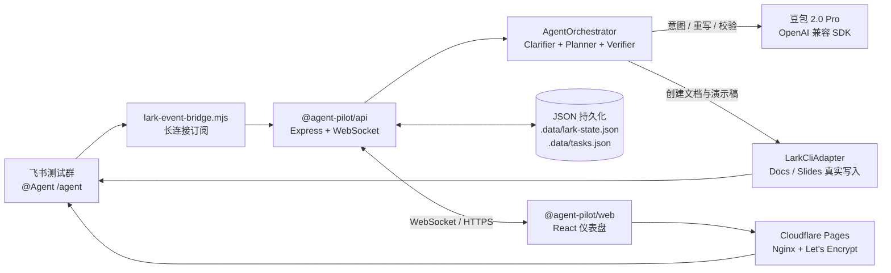

# 项目架构与评分映射

更新时间：2026.05.07

本文件用于复赛作品文档与现场答辩，把 Agent-Pilot 的核心架构和复赛评分维度（完整性 50% / 创新性 25% / 技术实现性 25%）一一对应，便于评委一眼定位关键证据。

## 1. 端到端架构

## 2. 核心模块速览

| 模块 | 路径 | 角色 |
| --- | --- | --- |
| AgentOrchestrator | `apps/api/src/agent/AgentOrchestrator.ts` | 任务驱动主控：澄清 → 计划 → 工具调用 → 校验 → 失败恢复 |
| Clarifier | `apps/api/src/agent/Clarifier.ts` | 模糊指令的主动澄清，避免反复追问 |
| ArtifactVerifier | `apps/api/src/agent/ArtifactVerifier.ts` | Docs / Slides 长度、结构、关键词的轻量验收 |
| SlidesXmlBuilder | `apps/api/src/slides/SlidesXmlBuilder.ts` | 9 种版式（封面、内容、双栏、流程、角色、时间线、KPI、对比、总结）的真实 Slides XML |
| LarkCliAdapter | `apps/api/src/adapters/LarkCliAdapter.ts` | 通过 `lark-cli` 真实写入 Docs / Slides 与回发 IM |
| 长连接桥接 | `scripts/lark-event-bridge.mjs` | 飞书事件长连接、白名单、自消息过滤、`messageId` 去重 |
| Web 运行台 | `apps/web/src/App.tsx` | 任务时间线、澄清 Banner、失败恢复提示、重试入口 |
| Delivery Doctor | `scripts/doctor-delivery.ps1` | 一键体检：typecheck / build / e2e / 线上 readiness |

## 3. 评分维度映射

### 3.1 完整性与价值（50%）

| 评委关注点 | 项目证据 |
| --- | --- |
| 是否形成端到端闭环 | 飞书 IM 触发 → Planner → Docs/Slides 真实写入 → 群回发链接 → Web 运行台同步 |
| 真实办公套件覆盖 | `LarkCliAdapter` 调用 `lark-cli docs +create / slides +create`，已生成可打开的 Docs 与 Slides |
| 多端体验 | Web 仪表盘 + Cloudflare Pages 入口，飞书桌面端 / 手机端均可作为网页应用打开 |
| 可演示稳定性 | systemd 三服务常驻、Let's Encrypt 证书、`/health` `/api/readiness` 双探针 |

### 3.2 创新性（25%）

| 评委关注点 | 项目证据 |
| --- | --- |
| Agent 主驾驶 | Clarifier 主动澄清 + Verifier 自动校验 + 失败恢复建议构成的 Agent 闭环 |
| 工具级可观测 | Web 运行台展示工具事件、耗时、状态色与重试入口 |
| Slides 真实 XML 渲染 | 9 种版式（含 KPI 卡片与 Before/After 对比）由模板自动选择，避免堆 markdown |
| 失败可重试 | 任务失败时记录失败步骤、工具、错误，并允许从仪表盘单点重试 |

### 3.3 技术实现性（25%）

| 评委关注点 | 项目证据 |
| --- | --- |
| 工程组织 | TypeScript monorepo（npm workspaces），共享类型 `packages/shared` |
| 真实接入 | 豆包 2.0 Pro（OpenAI 兼容）+ 飞书长连接 + 真实 Docs/Slides 写入 |
| 测试与回归 | 18 条 Playwright E2E（覆盖澄清、Clarifier、Slides Builder、状态持久化、Verifier、KPI 与对比版式） |
| 运维与部署 | systemd + Nginx + Let's Encrypt + Cloudflare Pages + delivery doctor 自检 |
| 数据治理 | `.data/lark-state.json` 与 `.data/tasks.json` 提供幂等去重与任务持久化 |

## 4. 演示动线建议

1. 在飞书测试群发送 `/agent` 触发任务，让 Agent 主动澄清并等待用户确认。
2. 切回 Web 运行台展示任务时间线、工具耗时、Verifier 结果。
3. 打开生成的真实 Docs 和 Slides，重点演示 Slides 的多种版式（封面 / 流程 / KPI / 对比 / 总结）。
4. 回到飞书群展示回发的链接、讲稿建议和下一步推荐。
5. 用 `npm run doctor:delivery` 与线上 `/api/readiness` 截图证明可被远程验收。

## 5. 已知边界（保持透明）

- 当前移动端与桌面端是同一份 Web 应用在飞书客户端内的两种宽度形态，并非原生客户端。
- 持久化使用 JSON 文件，适合比赛演示与轻量部署，长期运行建议迁移 SQLite 或云端数据库。
- 飞书事件接入主线为长连接；如需切 webhook，需补 raw body 签名校验与回调握手。
- 语音入口、富媒体处理、自由画布尚未完成，列在加分项与后续路线中。
